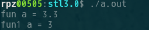
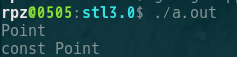

# 全特化和偏特化

### 前言

关于讲过`traits`萃取器的时候探讨到偏特化的概念, 而在那一篇文章也没有具体解释偏特化是什么, 怎么实现, 所以可能在第一次看得时候会很莫名其妙. 所以我将偏特化放在其后讲解, 为不明白的朋友做一个浅析的讲解. 这里我先聊一下全特化再聊偏特化. 


### 全特化

**全特化的模板参数列表应该是为空, 函数和类都可以实现全特化.**

```c++
template<class T>
void fun(T a)
{
	cout << "fun a = " << a << endl;
}

template<>
void fun(int a)
{
	cout << "fun1 a = " << a << endl;
}

int main()
{
	fun(3.3);
	fun(3);

	exit(0);
}
```

结果如下



这就是函数全特化, 根据传入的参数让编译器自动推导参数的类型来调用其特殊的函数. 

记住: 

1.  **函数的全特化不是重载, 不是重载.**  
2.  **全特化的参数列表要为空, 为空**
3.  第二点成立是因为我们要实现一个相同的模板, 一个相同的模板

同样, 类的全特化也是一样的, 只要满足上面的三点就行了.


### 偏特化

**函数不能偏特化, 类可以偏特化.** 

偏特化需要在运行实例化的时候才能推导确定使用哪一个模板类.  偏特化也是以`template`来声明的，需要给出剩余的”模板形参”和必要的”模板实参”.

```c++
template<class T>
class Point
{
	public:
		void Print()
		{
			cout << "Point" << endl;
		}
};
template<class T>
class Point<const T>
{
	public:
		void Print()
		{
			cout << "const Point" << endl;
		}
};
int main()
{
	Point<double> b;
	b.Print();
	Point<const int> c;
	c.Print();

	exit(0);
}
```


以上就实现了一个关于`const T`的偏特化, 这就很像`traits萃取器`实现的偏特化了.



偏特化的重点 : 

1.  函数不能偏特化, 因为函数可以重载, 也就可以实现类型偏特化一样的功, 而类不可以重载.
2.  偏特化只是针对一些特殊的参数类型.
3.  偏特化实现了类的"重载".

还有**除了可以特化类模板之外, 还可以对类模板中的成员函数和普通静态成员变量进行特化**.


### 优先级

上面全特化和偏特化还有一点没有谈论到, 关于优先级. 现在我们就来看一下

```c++
// 这是上面的一个实例
fun(3.3);
fun(3);
```

fun(3)的函数不是调用`template<class T> void fun(T a)`而优先调用的是`<int>`的全特化模板. 

同样偏特化的的例子也能证明这一点

```c++
Point<double> b;
b.Print();
Point<const int> c;
c.Print();
```

类优先调用了最合适的模板. 

上面就可以归纳为:

1.  全特化/偏特化, 普通模板(优先级从左到右依次减小)


现在我们再实现一个普通没有模板的fun函数

```c++
void fun(int a) {}
```

如果继续调用`fun(3)`, 你会发现此时没有任何输出. 那是不是没有实现的模板函数和类的实例会优先被调用呢? 确实如此. 

以上就可以归纳为 : 

1.  **全特化/偏特化, 普通模板(优先级从左到右依次减小)**
2.  **无模板函数优先级最高**


### 总结

**函数只能全特化, 不能偏特化, 类既可以全特化, 也可以偏特化.**  函数不能偏特化但是可以重载, 类不能进行重载. 

**优先级 : 无模板函数 > 全特化/偏特化 > 普通模板** 

现在如果重新去看`traits萃取器`应该就能理解`traits`编程使用偏特化的意义.